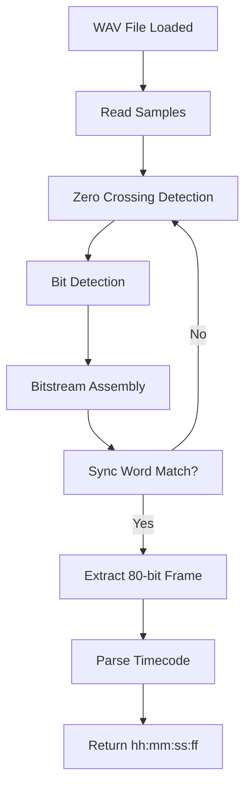

# LTC-Wav-Decoder

This project decodes SMPTE Linear Timecode (LTC) from an audio file (WAV format). SMPTE LTC is a format used to encode timecode data as an audio signal, commonly used in video and film post-production to sync devices.

Sure — let’s do a **technical breakdown** of how the SMPTE LTC Timecode decoder works, based on the code in the ZIP you provided.

---

## 🎯 **Goal**
To decode **SMPTE Linear Timecode (LTC)** from a WAV audio file — this involves detecting square wave audio patterns and translating them into binary timecode data.

---

## 🧰 **Key Components**

### 1. `ltc_decoder.c` / `ltc_decoder.h`
This is the **core decoding engine**.

#### What it does:
- Implements a **zero-crossing detector** (to find changes in the waveform).
- Measures the **duration between crossings** to distinguish between `0` and `1` bits.
- Identifies **80-bit LTC frames** (with a sync word at the end).
- Parses the frame into timecode (hh:mm:ss:ff).

#### Key structures/functions:
- `ltc_decoder_feed()`: Accepts PCM samples and detects transitions.
- `ltc_decoder_get_frame()`: Retrieves a valid LTC frame once found.
- `ltc_frame_t`: Struct that stores decoded timecode data.

---

### 2. `bitstream.c` / `bitstream.h`
Handles **bit-level data buffering**.

#### What it does:
- Buffers incoming bits.
- Detects the **LTC sync word** (typically `0011111111111101`).
- Builds a complete 80-bit frame for decoding.

---

### 3. `wavfile.c` / `wavfile.h`
Reads 16-bit PCM WAV files.

#### What it does:
- Opens and parses WAV headers.
- Reads audio samples into a buffer.
- Converts stereo to mono if needed.

---

### 4. Objective-C Interface (e.g., `main.m`)
Provides a **user interface or test harness** to:
- Load a WAV file.
- Feed its audio samples into the decoder.
- Output the decoded timecodes.

---

## 🔄 **End-to-End Flow**

---

## 🧠 **Important Algorithms**

### 🔹 **Zero-Crossing Detection**
- Detects when the audio waveform goes from positive to negative (or vice versa).
- Used to determine the start of a bit period.

### 🔹 **Bit Value Calculation**
- Short duration = `1`, long duration = `0`.
- Based on duration between zero crossings.

### 🔹 **LTC Sync Word**
- The last 16 bits of a valid frame always form a sync word.
- Decoder waits for this pattern to lock on.

---

## 🔎 **Example Timecode Frame**

A full LTC frame is **80 bits**, structured like this:

| Field         | Bits        |
|---------------|-------------|
| Frames        | 8           |
| Seconds       | 8           |
| Minutes       | 8           |
| Hours         | 8           |
| User Bits     | 32          |
| Sync Word     | 16 (fixed)  |

Each byte has even parity, and BCD-encoded values (e.g., 4 bits for tens, 4 for units).

---

## ✅ **Summary**
This tool:
- Uses **audio signal analysis** to recover a digital timecode from LTC audio.
- Implements **bit parsing**, **sync detection**, and **frame decoding** entirely in C.
- Has a **simple Objective-C interface** to test and display results.

Let me know if you want to dive into how a specific part (like the sync word detection or parity check) works line-by-line.
